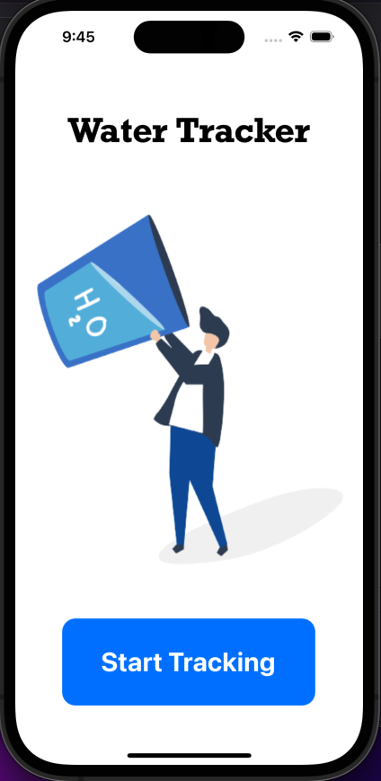
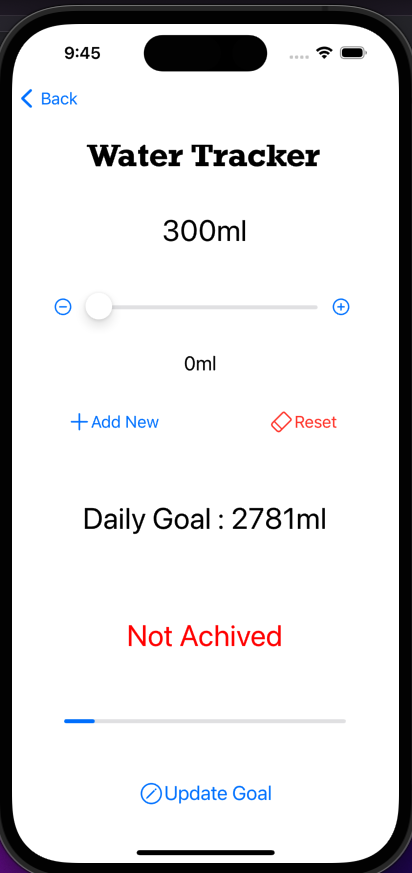

Please go under edit and edit this file as needed for your project.  There is no separate documentation needed.

# Project Name - Water Tracker
# Student Id - IT20603236
# Student Name - Jayasooriya M.N.N.J

#### 01. Brief Description of Project 

* The app is designed to help users maintain healthy hydration habits by allowing them to track their daily water intake and set personalised intake goals to achieve them. By logging each glass of water or other beverage they consume throughout the day, users can easily monitor their progress towards their hydration targets. By using this app to stay on top of their hydration habits, users can improve their overall health and well-being by avoiding dehydration, which can lead to fatigue, headaches, and other negative symptoms. With regular use, this app can help users establish a healthy routine of drinking enough water each day to support their body's needs.

#### 02. Users of the System 
* Individuals who want to monitor and improve their overall health and fitness by staying hydrated.

#### 03. What is unique about your solution 
* Application has a very simple and user friendly interface which allows any type of users to easily use it and uses core data to preserve the data despite the app restarting so the tracking functionality is accurate and useable and has ability to add intakes, view them and reset the data making it more useful. 

#### 04. Briefly document the functionality of the screens you have (Include screen shots of images)
* Screen 1 is the start screen and it has a button to navigate to the main screen.
* Screen 2 is the main screen and it shows following details,
- daily water intake
- daily goal
- status (Goal achieved or not)
* it has following functionalities,
- add new intake
- reset daily intake data
* Screen 3 has the functionality to change the goal
 

  
    

#### 05. Give examples of best practices used when writing code.

* I have used relevant naming for the variables and used functions to make the code more simple and reusable.
 
class DataModel{
    public static var daily : Int = 0
    public static var goalval : Int = 3000
}

func updateStatus(){
        if DataModel.daily > DataModel.goalval{
            status.text = "Achived"
            status.textColor = UIColor.green
            progress.progress = 1
        }else{
            status.text = "Not Achived"
            status.textColor = UIColor.red
            progress.progress = Float(DataModel.daily) / Float(DataModel.goalval)
        }
}

#### 06. UI Components used

* The following components were used in the App, UIButton, UIAlert, UIViewController, UINavigationController, UISlider, UIImageView, UILabel, UIprogressbar

#### 07. Testing carried out

* XCTesting framework is implemented for testing.
* Following test cases were carried out to test fetchDaily and fetchGoal functions

    func testfetchDaily() throws {

        let result = fetchDaily() > 0
        XCTAssertEqual(result, true, "Negative Values Are Not Accepted")

    }
    func testfetchGoal() throws {

        let result = fetchGoal() > 0
        XCTAssertEqual(result, true, "Negative Values Are Not Accepted")

#### 08. Documentation 

(a) Design Choices
* very simple and user friendly design is used. The instructions are straight forward. Inbuilt IOS components are used such as Sliders and Navigation Controller. white colour theme is used. Two simple images are used to increase the attractiveness. Used components like progress bars to visualise the data more clearly.

(b) Implementation Decisions
* used an iPhone as the target device. Used core data to preserve the data. Used navigation controller to navigate through View Controllers and XCTesting for unit testing.

(c) Challenges
* transiting to macOS for the first time.
* using Xcode for the first time.
* faced difficulties when deciding what kind of an app should be developed.
* there was a learning curve for core data, navigation controllers and XCTesting 

#### 09. Reflection

* This assignment was little bit challenging since this is my first time developing an IOS application without any guidance. As a life long windows user, transiting to a MacBook for the first time was quite challenging as I was not used to using MacBook specific apps and MacOS. But after using MacOS for few weeks I learned to use it efficiently. Xcode is one of the macOS specific app that took some time for me to get used to. However after watching various YouTube videos and referring to blogs and articles I was able to build my first IOS application successfully
  

